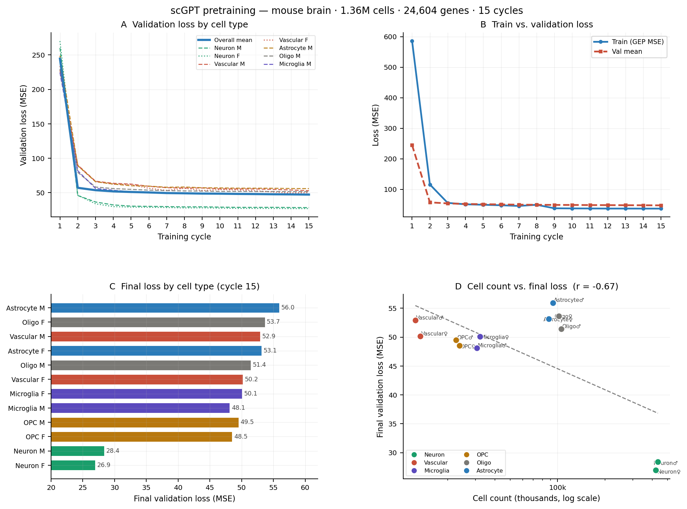

## scFM — Single-Cell Foundation Model

This repository implements scFM (single-cell Foundation Model) from scratch across four modules: input embeddings, masked attention transformer, fine-tuning objectives, and gene regulatory network (GRN) inference.
The model is pretrained on a single-cell RNA sequencing dataset of mouse brain tissue generously provided by the Kuofen Lee lab (data not publicly available). The dataset spans six major brain cell types — neurons, astrocytes, microglia, oligodendrocyte precursor cells (OPCs), oligodendrocytes, and vascular cells — profiled separately by sex, yielding 12 cell-type/sex groups totalling 1.36 million cells across 24,604 genes.

---

## Pretraining results

The model was pretrained on **1.36 million mouse brain cells** spanning 12 cell-type/sex combinations across 24,604 genes. Training used the Gene Expression Prediction (GEP) objective with value-binned expression (51 bins), a variable masking ratio uniformly drawn from {0.25, 0.50, 0.75}, and a cosine warm-up learning rate schedule repeated over **15 data cycles** (~10 shards per cycle).

### Dataset

| Cell type | Male | Female | Total |
|---|---:|---:|---:|
| Neuron | 433,660 | 419,437 | 853,097 |
| Oligodendrocyte | 105,230 | 101,781 | 207,011 |
| Astrocyte | 93,335 | 87,877 | 181,212 |
| Microglia | 30,623 | 32,056 | 62,679 |
| OPC | 22,666 | 23,734 | 46,400 |
| Vascular | 12,463 | 13,393 | 25,856 |
| **Total** | **697,977** | **678,278** | **1,376,255** |

### Training configuration

| Hyperparameter | Value |
|---|---|
| Embedding dimension | 512 |
| Transformer layers | 12 |
| Attention heads | 8 |
| FFN dimension | 512 |
| Expression bins | 51 |
| Max sequence length | 1,200 genes |
| Mask ratios | {0.25, 0.50, 0.75} |
| Batch size | 32 |
| Peak learning rate | 1 × 10⁻⁴ |
| LR schedule | Cosine warm-up per cycle |
| Optimizer | AdamW (wd = 0.01) |
| Gradient clip | 1.0 |
| Training cycles | 15 |

### Summary metrics

| Metric | Value |
|---|---|
| Initial validation loss (cycle 1) | 244.64 |
| Final validation loss (cycle 15) | 47.34 |
| Total loss reduction | 80.7% |
| Lowest cell-type loss | Neuron F — 26.95 |
| Highest cell-type loss | Astrocyte M — 55.95 |

### Training curves

> **Figure.** **(A)** Validation loss by cell type across 15 training cycles. The overall mean (blue) and per-type traces show rapid convergence in the first two cycles, followed by steady improvement. Neurons (green) consistently achieve the lowest loss. **(B)** Training and validation loss track closely throughout, indicating no significant overfitting. **(C)** Final validation loss ranked by cell type. Neurons are the easiest to predict (sparse, distinctive profiles), while astrocytes and vascular cells are hardest. **(D)** Cell count vs. final validation loss on a log scale (Pearson r = −0.72). Cell types with more training examples — neurons (~850k), oligodendrocytes (~207k), astrocytes (~181k) — achieve lower loss, consistent with standard scaling behaviour. The dashed line shows the log-linear regression trend.

A print-quality PDF of this figure is available at [`training_results.pdf`](training_results.pdf).

---

## Modules

| Module | File | Topics |
|---|---|---|
| 1 | `module1_foundations.py` | Gene vocabulary, value binning, three-part input embedding |
| 2 | `module2_transformer.py` | Masked attention, transformer blocks, GEP pretraining loss |
| 3 | `module3_finetuning.py` | GEPC, ECS, DAR/gradient reversal, cell-type classification |
| 4 | `module4_training_grn.py` | Training loop, perturbation prediction, GRN inference |

---

## License

MIT License. See `LICENSE` for details.
